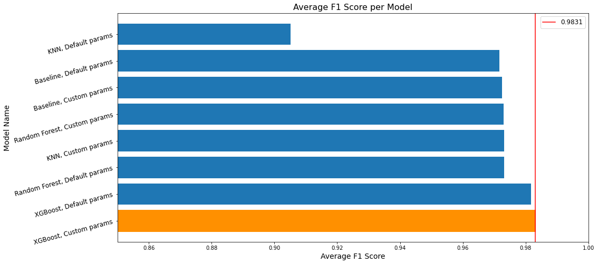
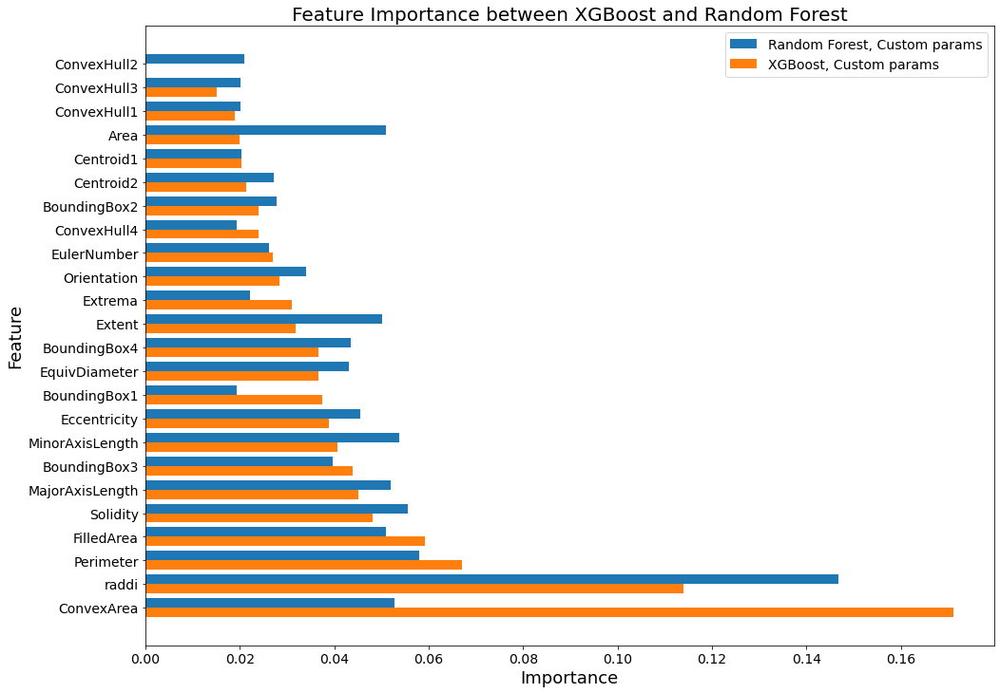
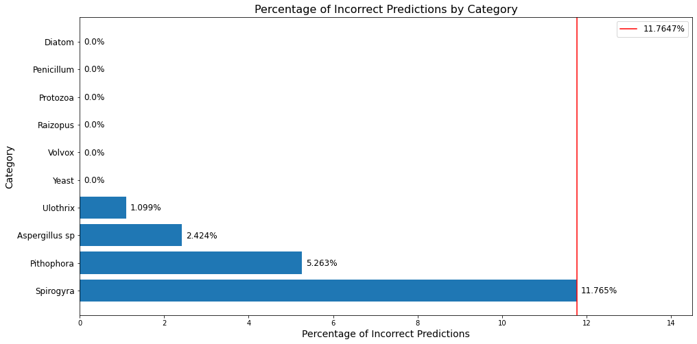
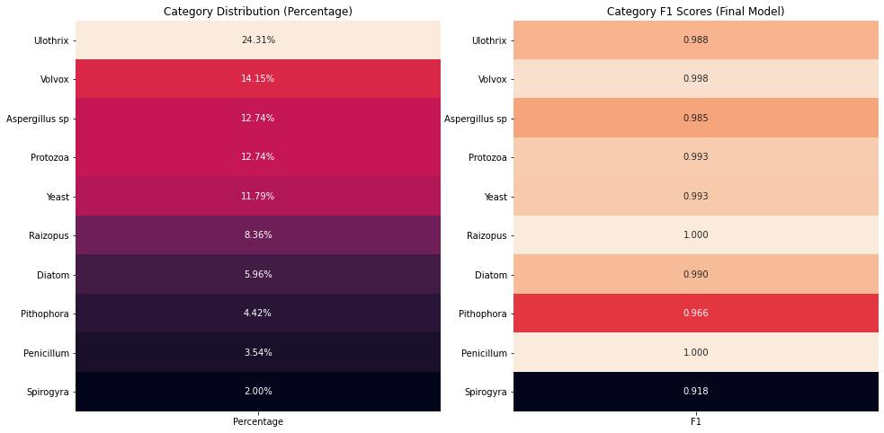
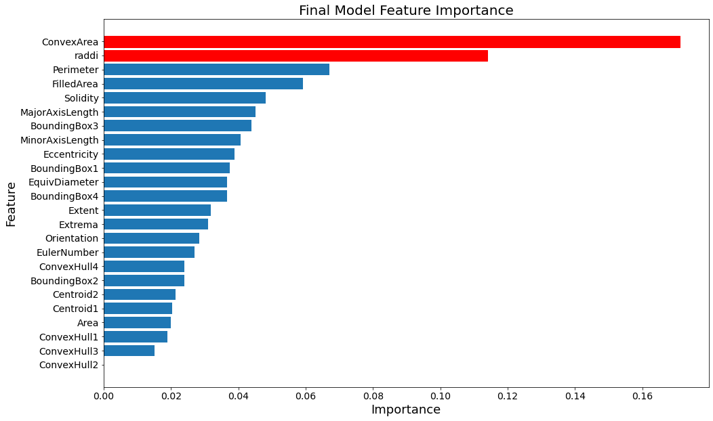

# Microorganism Classification Project
**Author:** Kai Uechi

## Overview

The aim of this project is to create a classification model that can accurately identify types of microorganisms. Such a model is especially valuable in situations where identification using DNA sequencing techniques would take too long. After training several models on data extracted from microscopic images, the best performing model was able to achieve 98.9% accuracy. This final model's performance is sufficient for application to identify microorganisms by genus, although it's performance could be improved with more accurate and balanced data.


## Business Problem
A hospital needs to identify different types of microorganisms for a variety of reasons, like diagnosing infections and determining antibiotic resistance. Although modern DNA sequencing techniques have improved speed, it still takes several hours to receive results. Utilizing machine learning classification, it is possible to identify types of microorganisms faster and more economically than can be achieved with sequencing.


## Data Understanding
The dataset used in this project consists of information extracted from microscopic images. The dataset includes information regarding various genera and classes of fungi and algae, as well as protozoa. There are 10 categories in total.

Some of these microorganisms display antibiotic properties, such as penicillium and spirogyra.
Others, such as protozoa and yeast, are responsible for harmful infections.

The features included in this dataset are as follows:

* `Solidity` - Ratio of an object's area to the area of its convex hull
* `Eccentricity` - Ratio of the length of an object's major axis to the length of its minor axis
* `EquivDiameter` - The diameter of a circle with area equivalent to the region
* `Extrema` - Extrema points within the region
* `FilledArea` - Number of pixels, returned as a scalar
* `Extent` - Ratio of the area of a region in pixels to the area of the bounding box
* `Orientation` - Direction of the shape. (Values range from -90 to 90 degrees)
* `EulerNumber` - Number of objects in the region minus the number of holes in those objects
* `BoundingBox` - Size and position of the smallest rectangle that contains the object
* `ConvexHull` - Smallest convex polygon that contains the object
* `MajorAxisLength` - Length in pixels of the major axis of the object
* `MinorAxisLength` - Length in pixels of the minor axis of the object
* `Perimeter` - Total number of pixels around the border of the region
* `Centroid` - Object's location within the image
* `Area` - Total number of pixels in the region

## Data Preparation
Having been extracted from images, the values in this dataset are all continuous and require little preprocessing.

The data preparation steps are as follows:
* The data is split between predictor columns and the target column
* The data is split into train and test sets to validate model performance
* The predictor features of all models are scaled by sklearn's `StandardScaler`
* In the case of the KNN model specifically, `SMOTE` oversampling is used to address target class imbalance

## Modeling
In the following section, several types of classification models are trained on the dataset and tested for their performance. After each model, a confusion matrix (Blue Graph) and a graph summarizing the models performance (Green Graph) are generated.

The types of models used are:
* `Decision Tree`
* `K-Nearest Neighbors`
* `Random Forest`
* `XGBoost`

For each of these models, one instance of the model is trained on the data using default parameters, while the other uses optimal parameters as determined by sklearn's `GridSearchCV` function. The cells containing the `GridSearchCV` training code will save the finished model to `/models`, and will automatically load a saved model if it already exists.

The largest challenge in creating these models is the class imbalance present in the dataset, as shown at the end of the 'Data Understanding' section. In most cases, this class imbalance is addressed using class weights, but in the case of the `KNN` model, `SMOTE` oversampling is used.

Ultimately, the `XGBoost` model with custom parameters performs best, so it becomes the final model.

## Findings
### Predictive Ability
The XGBoost model with custom parameters performed the best out of all the models, making it the final model.
This final model possesses an accuracy of `98.9%`, making it well suited to predicting the 10 categories in this data set. 

For the categories `Volvox`, `Yeast`, `Raizopus`, `Protozoa`, `Penicillium`, and `Diatom`, the model correctly identified all instances of these categories.

Other categories that had less prevalence in the dataset, such as `Spirogyra` and `Pithophora`, are not predicted as accurately.

Despite this, the overall performance of the model is very good, with a average F1 score of `0.9831`

The graph below shows the average F1 score of the final model as compared to the other, earlier models.




### Feature Importance

The final model prioritized the feature `ConvexArea` highest, followed by `raddi` and `Perimeter`.

This is distinct from the earlier Random Forest models, which focuesd more on `raddi`, while `ConvexArea` was only the fourth most important feature. The graph below visualizes this.



## Recommendations
This project arrives at three immediate recommendations in order to best utilize the final model and allow the creation of more accurate models in the future.

* Deploy Model for Use
* Collect Additional Spirogyra Data
* Increase Accuracy of Key Feature Collection

### Deploy Model for Use

The final model's predictive ability is sufficient for applications requiring rapid identification of microorganisms between the model's 10 categories. An example of this would be determining antibiotic resistance for patients in septic shock as a result of a bacterial infection.


If the model is either available locally or hosted as a webapp, a technician would be able to receive results immediately after the extracted image data is sent.

An important caveat is that the model is less effective at predicting Spirogyra compared to other genera. The graph below visualizes this difference. It is important to keep this limitation in mind, as other methods of identification may be preferable in situations where detecting microorganisms of the Spirogyra genus is critical.



### Collect Additional Spirogyra Data

With more data, it may be possible to improve the effectiveness of this model further.
As the graphs below show, the troubled category `Spirogyra` is also the category with the least data samples. Therefore, collecting more `Spirogyra` data should improve the model's ability to detect microorganisms of this genus.



### Collect Key Features With Increased Accuracy

Certain features of the data are more helpful in determining the type of microorganism than others. As shown in the graph below, the two features that are most significant to the final model are `ConvexArea` and `raddi`.

In the current dataset, `ConvexArea` is recorded to three decimal places of accuracy while `raddi` is recorded to only two.
If these features are recorded to a greater degree of detail, the model's predictive ability may be improved.



### Next steps
**Collect Data to Expand Model Categories**

By collecting data regarding additional types of microorganisms, it may be possible to detect a wider variety of categories using machine learning. Similarly, if more detailed data is collected, it may be possible to identify individual species of microorganisms within the existing categories.

## For More Information

Review the [Jupyter Notebook](./microorganism-classification.ipynb) or the [presentation pdf](./microorganism-classification_ProjectPresentation.pdf) for more information.

For any additional questions, please contact **Kai Uechi (kaiuechi@gmail.com)**


## Repository Structure
***

    ├── code
    │   └── draft.ipynb  -An unorganized, experimental notebook from earlier in the project
    ├── data  -Contains the dataset as a .csv file
    ├── images  -Contains images used in README
    ├── models  -Contains classification models saved as .pkl
    ├── README.md  -Overview of analysis and repo contents
    ├── microorganism-classification_ProjectPresentation.pdf  -A slide deck for presenting this project
    └── microorganism-classification.ipynb  -The final notebook for this project.

```python